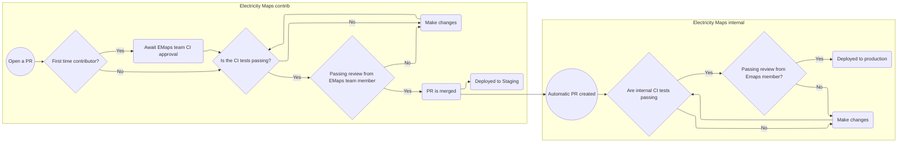

# Welcome! 🎉

Welcome to the Electricity Maps open source contribution repository.  
Any and all contributions however big or small are welcome.

# Links

- [README][readme]
- [Code of Conduct][code of conduct]
- [License][license]
- [Wiki][wiki]

# Code of Conduct

This repository and by extension its community have adopted the [Contributor Covenant][contributor covenant] v2.1 as its code of conduct.
If you have any questions about the code of conduct or feel the need to report an incident you can do so by emailing us at codeofconduct@electricitymaps.com. For the full code of conduct see [CODE_OF_CONDUCT.md][code of conduct].

# License

We use the GNU Affero General Public License v3.0 for this repository, check the [LICENSE.md][license] file details about what exactly this entails. Contributions prior to commit [cb9664f][commit cb9664f] where licensed under [MIT license][old_license]

# Getting Started

## Non-code contributions

There are several ways to help out without coding, these are primarily:

- Opening issues for bugs.
- Opening issues for data problems.
- Opening and/or participating in discussions about new data sources, features, and more.
- Opening issues when capacity data sources have been updated or changed.
- Finding new data sources, wiki page: [Find data sources][wiki find data sources]
- Verify existing data sources, wiki page: [Verify data sources][wiki verify data sources]
- Adding new or updating our existing translations, wiki page: [Translating app.electricitymaps.com][wiki translating the app]
- And more!

> **Note**
> Take a look at the wiki pages for more detailed instructions

## Zone and exchange configurations

Static information about zones and exchanges are located at [config/zones][config zones] and [config/exchanges][config exchanges] respectively.
The zone configurations hold information such as the installed capacity, which parsers to use, fallback mixes, contributors and other keys that are required by our frontend and internal systems; and while similar the exchange configs hold the location, capacity, direction and parsers required.

## Parser guidelines

To get started with editing the parsers use the following steps:

1. Run `uv sync --extra parsers` to install all needed dependencies.
2. Use `uv run test_parser ZONE_KEY` to test any parser changes.

Note: This requires you to have [Python 3.10][python homepage] and [uv][uv homepage] installed, you can see their respective installation guides here:

- [Downloading Python][python install guide]
- [uv installation][uv install guide]

### Parser information

For more detailed information about parsers specifically you can look at the parser [README][parser readme] located at [electricitymap/contrib/parsers/README.md][parser readme] with specific information about the parser functions located in the [electricitymap/contrib/parser/example][parser examples folder] folder

#### Example parser:

For an example of how a parser can look we have an example here:   [electricitymap/contrib/parsers/examples/example_parser.py][example parser]

### Formatting the parsers

We use [black][black homepage] and [isort][isort homepage] as code formatters for python which is automatically checked in the CI job `Python / Formatting`.

If this jobs fails and you need to manually format the code you can run `uv run format` in the top level of the repository.

Check the [wiki page][wiki python code formatting] for more details and tips.

# Contribution lifecycle

In order for your PR to be accepted and deployed it will need to pass a series of checks, these checks will be defined and explained in the following section of this document.

## Overview

## Description

In order to do code changes to the Electricity Maps repository you need to fork the repo and make changes in your own fork and then open a pull request (PR) against the Electricity Maps repository.

Once this has been done the automatic and manual review process starts, this consists of manual approval of the CI pipeline if you are a first time contributor, if the CI pipeline passes a team member will review your specific code changes. If they pass all automated tests and manual review from a Electricity Maps Employee it will be merged in our contrib PR. This does not mean it will be automatically de deployed or that the changes will be instantly visible.

If there is parser changes these go on to more internal tests that includes both automated test suits and manual reviews. Once everything passes and an approval has been granted a new release will be created that updates the production environment for both the frontend and parser changes.

<!-- Link definitions to keep the text clean -->

[uv homepage]: https://github.com/astral-sh/uv
[python homepage]: https://www.python.org/
[python install guide]: https://wiki.python.org/moin/BeginnersGuide/Download
[uv install guide]: https://docs.astral.sh/uv/getting-started/installation/
[example parser]: https://github.com/electricitymaps/electricitymaps-contrib/blob/master/electricitymap/contrib/parsers/examples/example_parser.py
[black homepage]: https://github.com/psf/black
[isort homepage]: https://pycqa.github.io/isort/
[wiki python code formatting]: https://github.com/electricitymaps/electricitymaps-contrib/wiki/Format-your-code-contribution#python-code-formatting
[readme]: https://github.com/electricitymaps/electricitymaps-contrib/blob/master/README.md
[code of conduct]: https://github.com/electricitymaps/electricitymaps-contrib/blob/master/CODE_OF_CONDUCT.md
[license]: https://github.com/electricitymaps/electricitymaps-contrib/blob/master/LICENSE.md
[wiki]: https://github.com/electricitymaps/electricitymaps-contrib/wiki
[wiki find data sources]: https://github.com/electricitymaps/electricitymaps-contrib/wiki/Find-data-sources
[wiki verify data sources]: https://github.com/electricitymaps/electricitymaps-contrib/wiki/Verify-data-sources
[contributor covenant]: https://www.contributor-covenant.org/
[commit cb9664f]: https://github.com/electricitymaps/electricitymaps-contrib/commit/cb9664f43f0597bedf13e832047c3fc10e67ba4e
[old_license]: https://github.com/electricitymaps/electricitymaps-contrib/blob/master/LICENSE_MIT.txt
[config zones]: https://github.com/electricitymaps/electricitymaps-contrib/tree/master/config/zones
[config exchanges]: https://github.com/electricitymaps/electricitymaps-contrib/tree/master/config/exchanges
[parser readme]: https://github.com/electricitymaps/electricitymaps-contrib/tree/master/parsers/README.md
[parser examples folder]: https://github.com/electricitymaps/electricitymaps-contrib/blob/master/electricitymap/contrib/parsers/examples/
