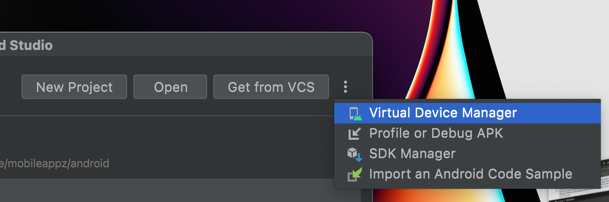

# Electricity Maps Mobile Apps

This is a capacitor project that builds the mobile apps from the web directory

## Prerequisites:

https://capacitorjs.com/docs/getting-started/environment-setup

Xcode

Android Studio

- install JDK v8 <-- to avoid having to create an Oracle account(!), you can find a `jdk-8u321-macosx-x64.dmg` in our internal Google Drive.
- `brew install gradle`
- install Android Studio - make sure you open it and go through the install wizard in the start
  - Also go to Tools > SDK Manager and install SDK v29
- Follow the steps here: https://www.brainfever.co.uk/2022/02/04/build-tool-32-1-0-rc1-is-missing-dx-at/
  - instead of last step, add the following to your `.zshrc` file:
  ```bash
  export JAVA_HOME=/Library/Java/JavaVirtualMachines/jdk1.8.0_321.jdk/Contents/Home
  export PATH=$JAVA_HOME/bin:$PATH
  export PATH=$PATH:/Library/Android/sdk/platform-tools
  export PATH=$PATH:/Library/Android/sdk/tools
  export ANDROID_SDK_ROOT=~/Library/Android/sdk
  export ANDROID_HOME=~/Library/Android/sdk
  ```

Node 18+

## If you have the web app installed and running and want to do production builds the following commands will run everything you need

Navigate to mobileapp

`pnpm build-ios`
`pnpm build-android`

## Detailed instruction if the above doesn't work. First make sure you have installed and built the web app:

Navigate to the web directory then:

`pnpm install`

`pnpm build`

To enable hot reload you must runt he web app locally on port 5173:

`pnpm dev`

Navigate to the moibleapp directory then:

`pnpm install`

Add Android and iOS:

`pnpm exec cap add android`
`pnpm exec cap add ios`

Copy Assets to app directories:

`pnpm exec cap copy`

Sync the web project to capacitor:

`pnpm exec cap sync`

**Run the app locally with hot reload**

Android:

`pnpm dev-android`

iOS:

`pnpm dev-ios`

**Build app bundles**

App bundles are built through Android Studio and iOS
Android:

`pnpm exec open android`

iOS:

`pnpm exec open ios`

---

If you need more information:
https://capacitorjs.com/docs/getting-started

Android emulator not working?

Android studio will need a virtual device, shown here in the Android Studio opening screen:

